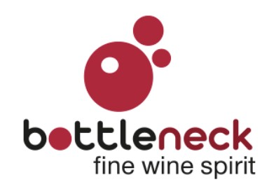

# Optimisez la gestion des données d'une boutique de vins avec Python

## Contexte et objectifs

  
Bottleneck est un marchand de vin prestigieux opérant en France.  

Nicolas, le Responsable vente chez Bottleneck, a du mal à analyser les données et nous remonte que la gestion des stocks est complexe.
Récemment embauchée chez BottleNeck en tant qu’analyste, la mission consiste à :  
- Agréger les différents fichiers afin de pouvoir exploiter les données
- Analyser les données pour le CODIR.

Différentes sources sont utilisées pour les exports :  
- Extraction de l’ERP  (référence produit, prix et l’état du stock)
- Extraction du site Web (SKU, quantités vendues, description des produits, etc.)
- Table de liaison qui permet de lier les références entre la base de données Wordpress et l’extraction de l’ERP de l’entreprise.

## Soft Skills
- Décortiquer des jeux de données pour des tendances, anomalies ou relations potentielles  
- Production de données propres, cohérentes et exploitables  
- Respect des règles de confidentialité et de sécurité dans l'utilisation des données personnelles  
- Prendre les bonnes décisions sur les transformations à appliquer, selon la finalité de l'analyse.

## Compétences
- Analyses univariées et multivariées des données pré-traitées  
- Traitement et nettoyage des données puis gestion des incohérences en conformité de la RGPD  
- Pré-traitement des données pour explorer et comprendre leurs caractéristiques.

## Outils utilisés
Notebook Jupyter

## 
>Attention ! : Ce projet a été réalisé dans le cadre de la formation "Data Analyst" avec l'organisme OpenClassrooms.
